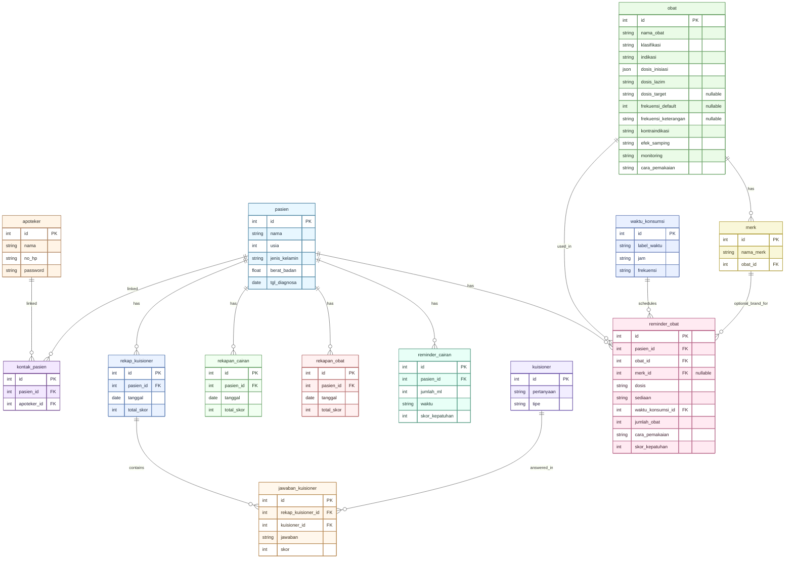

# Healthcare Medication Reminder System - ERD

## Legend

- PK: Primary Key (identifier unik untuk setiap record).
- FK: Foreign Key (kolom referensi ke PK pada tabel lain).
- Nullable FK: FK yang boleh kosong (contoh: reminder_obat.merk_id).

Relationship symbols (Mermaid ER):

- || : exactly one
- o| : zero or one
- |{ : one or many
- o{ : zero or many

Cardinality examples used:

- 1:N represented as `||--o{`
- M:N represented via junction table `kontak_pasien`:
  - `pasien ||--o{ kontak_pasien`
  - `apoteker ||--o{ kontak_pasien`
